# Kai Barker - Garden Grown

<!-- Add a banner image here, e.g.:

-->

## Table of Contents

1. [About the Project](#1-about-the-project)
   - 1.1 [Project Description](#11-project-description)
   - 1.2 [Built With](#12-built-with)
2. [Getting Started](#2-getting-started)
   - 2.1 [Prerequisites](#21-prerequisites)
   - 2.2 [How to Install](#22-how-to-install)
   - 2.3 [Available Scripts](#23-available-scripts)
3. [Features and Usage](#3-features-and-usage)
   - [Screenshots & Explanations](#screenshots--explanations)
4. [Mockups](#4-mockups)
5. [Demonstration Video](#5-demonstration-video)
6. [Architecture / System Design](#6-architecture--system-design)
7. [Highlights and Challenges](#7-highlights-and-challenges)
8. [Roadmap, Future Improvements](#8-roadmap-future-improvements)
9. [Contributing and License](#9-contributing-and-license)
10. [Authors and Contact Info](#10-authors)
11. [Acknowledgements](#11-acknowledgements)

---

## 1. About the Project

### 1.1 Project Description

**Garden Grown** is a mobile stress-reduction app built around one simple idea: *grow at your own pace*. Rather than guided meditations or breathing exercises that demand active focus, Garden Grown offers a passive, creative outlet, a digital zen garden the user can arrange and rearrange however they like.

The entire experience is built around a single constraint: **one hand only**. Every interaction is designed to be comfortable to perform with a thumb, so users can unwind in a relaxed posture, on the couch, in bed, or with a drink in the other hand, without needing to give the app their full attention. There are no timers, no scores, and no fail states (no plants can die); the only goal is a satisfying, rhythmic drag-and-drop experience.

Users can create an account, build and customise a garden on a grid by dragging elements (plants, decorations, terrain) into place, and have their layout saved and persisted so they can return to it at any time. Plants are planted as seeds and grow through stages when watered, and because growth is measured from the moment a plant is watered, a garden keeps growing while the app is closed. An unwatered plant simply waits, it never dies.

### 1.2 Built With

#### Frontend


Built on Expo SDK 54 with Expo Router for file-based navigation, React Native Gesture Handler for the drag-and-drop pipeline, and the Zen Loop and Zen Maru Gothic typefaces.

#### Backend / Services


---

## 2. Getting Started

### 2.1 Prerequisites

- Node.js (v18 or newer)
- npm
- A Firebase project with **Email/Password Authentication**, **Cloud Firestore**, and **Cloud Storage** all enabled (Storage is required for profile photos)
- Expo CLI / React Native tooling (Android Studio or Xcode for emulators, or the Expo Go app for a physical device)
- Git

### 2.2 How to Install

1. **Clone the Repository**

```bash
git clone https://github.com/Kai-Barker/GardenGrown.git
cd GardenGrown/GardenGrown
```

> Note: the Expo app lives one level below the repository root, so the second `GardenGrown` is intentional.

2. **Install Dependencies**

```bash
npm install
```

3. **Configure Firebase**

Create a `.env` file in the app folder (`GardenGrown/GardenGrown/`) with your Firebase project's config. Every key must carry the `EXPO_PUBLIC_` prefix, otherwise Expo will not expose it to the app and the Firebase config resolves to `undefined`:

```bash
EXPO_PUBLIC_FIREBASE_API_KEY=your_api_key
EXPO_PUBLIC_FIREBASE_AUTH_DOMAIN=your_project.firebaseapp.com
EXPO_PUBLIC_FIREBASE_PROJECT_ID=your_project_id
EXPO_PUBLIC_FIREBASE_STORAGE_BUCKET=your_project.appspot.com
EXPO_PUBLIC_FIREBASE_MESSAGING_SENDER_ID=your_sender_id
EXPO_PUBLIC_FIREBASE_APP_ID=your_app_id
```

4. **Run the App**

```bash
npx expo start
```

Then scan the QR code with Expo Go, or launch an Android/iOS emulator from the terminal menu.

### 2.3 Available Scripts

| Script | Command | Purpose |
|---|---|---|
| `npx expo start` | `expo start` | Start the Expo dev server |

---

## 3. Features and Usage

- **One-Handed by Design**: Every pressable element is large, thumb-reachable, and sits in the bottom half of the screen to keep the whole experience comfortable to use with a single hand.
- **Drag & Drop Garden Building**: The core mechanic, drag plants, decorations, and terrain from a bottom inventory dock and drop them onto a snapping 8 x 16 grid. A pulsing highlight shows where an item will land, green when the drop is valid and red when it is blocked.
- **Growth Stages**: Plants are placed as seeds and grow into their mature form. Flowers and small plants take a single step (seed, then grown), while trees and larger woody plants pass through a sapling stage first.
- **Watering**: Drag the watering can onto a plant to water it. Nothing grows until it is watered, and a thirsty plant is marked with a blue droplet. Each stage needs its own watering, so a tree takes two: one to raise the sapling, another to bring it to maturity.
- **Growth While You Are Away**: Each stage's timer runs from the moment that stage was watered, and that timestamp is saved, so plants keep growing while the app is closed and are up to date the next time the garden is opened.
- **Terrain Painting**: Paint grass, sand, and water onto individual cells from the Terrain tab to shape the ground, with an eraser to clear a cell back to bare earth. Terrain sits on its own layer, so a plant can still be planted on top of it.
- **Pinch to Zoom**: The garden canvas zooms up to 3x for precise placement, then pans back out to view the whole plot.
- **Move and Remove**: Drag an already-placed item to a new cell, or drag it to the bottom of the screen to remove it.
- **Multiple Gardens**: Create, name, switch between, and delete gardens. Deleting asks for confirmation first.
- **Onboarding Tour**: A three-slide first-run tour covering the dashboard, garden design, and the water-and-grow loop. It is replayable at any time from "How It Works" on the splash screen.
- **No Fail States**: No timers, no scores, and nothing dies. A plant left unwatered simply waits for you.
- **Haptic Feedback**: Distinct vibration patterns mark picking up an item, watering successfully, a rejected action, and deleting something, so the garden gives feedback without needing to be looked at closely.
- **Persistent Gardens**: Garden layouts are saved to Firestore so users can leave and pick up exactly where they left off.
- **Firebase Authentication**: Secure registration, login, and session management, with the session persisted between launches.
- **Dashboard**: An overview of the user's gardens with four stats, total gardens, total decorations, how long they have been gardening, and the item count of the plot currently being viewed, plus a swipeable carousel of garden previews.
- **Profile Management**: Update a username, upload a profile photo, and change a password (which re-authenticates first for safety).
- **Rounded, Calming UI**: Soft, rounded UI elements and a muted colour palette chosen specifically to feel relaxing rather than gamified.

### Screenshots & Explanations

**Splash / Log In / Sign Up**

| Splash | Log In | Sign Up |
|:---:|:---:|:---:|
| 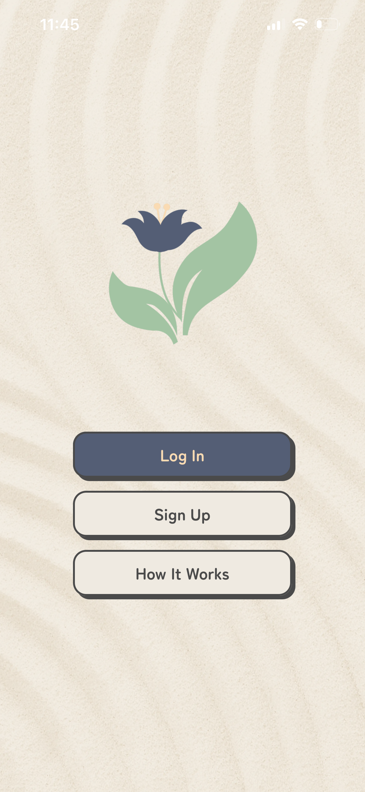 | 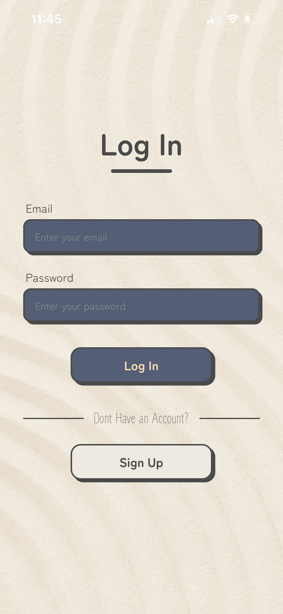 | 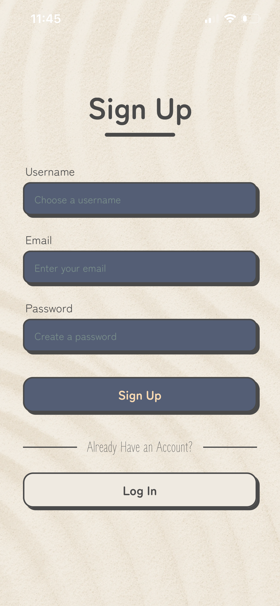 |

Entry point into the app, with minimal-typing forms to keep the one-handed constraint intact. The splash screen also offers a "How It Works" option that replays the onboarding tour.

**Onboarding**

| Dashboard | Design Your Garden | Water & Grow |
|:---:|:---:|:---:|
| 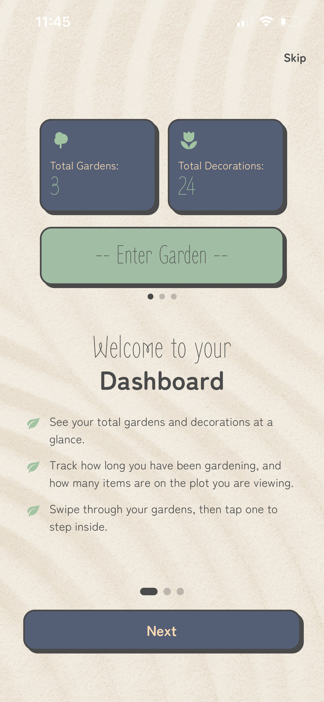 | 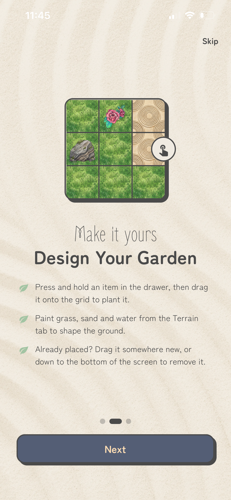 | 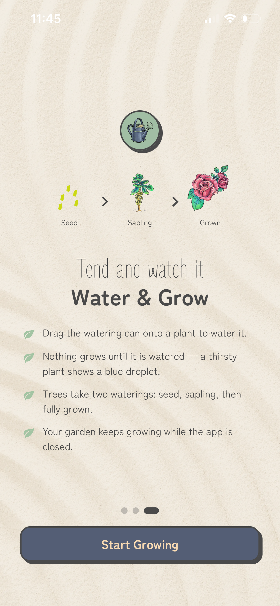 |

A three-slide tour shown on first launch, teaching the dashboard, the drag-and-drop and terrain tools, and the watering and growth loop. It can be skipped, and it is remembered per device rather than per account, since it teaches gestures rather than anything about a user's data.

**Dashboard / Garden**

| Dashboard | Garden |
|:---:|:---:|
| 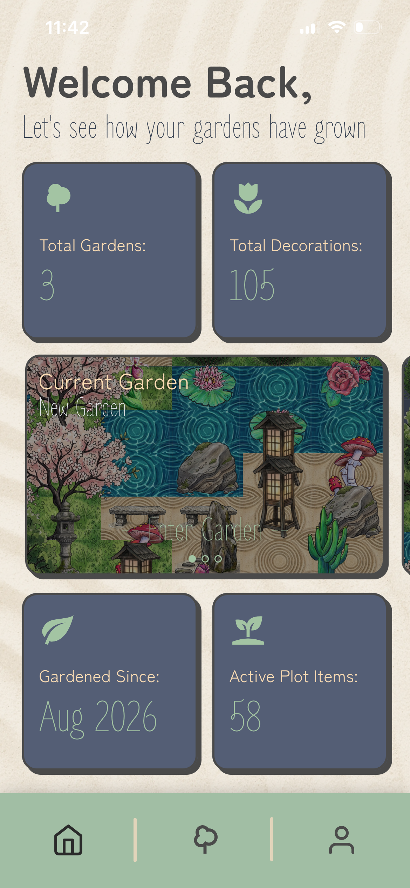 | 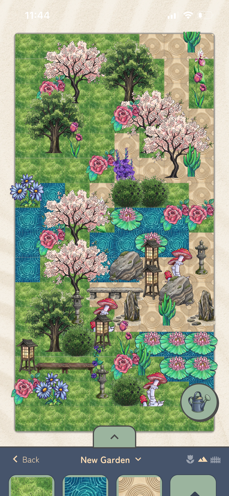 |

The dashboard shows the user's gardens at a glance with total gardens, total decorations, how long they have been gardening, and the active plot's item count. The garden screen is the core drag-and-drop experience, where elements snap onto a grid, with the inventory dock and watering can tucked away at the bottom to maximise workspace and stay within thumb reach.

**Profile**

| Profile |
|:---:|
| 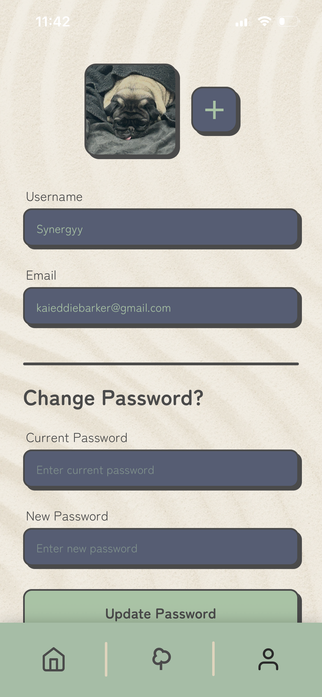 |

Displays the user's account details and gardening stats, and allows updating a username, profile photo, and password.

---

## 4. Mockups

The design mockups for the built screens.

**Splash**


**Sign Up**

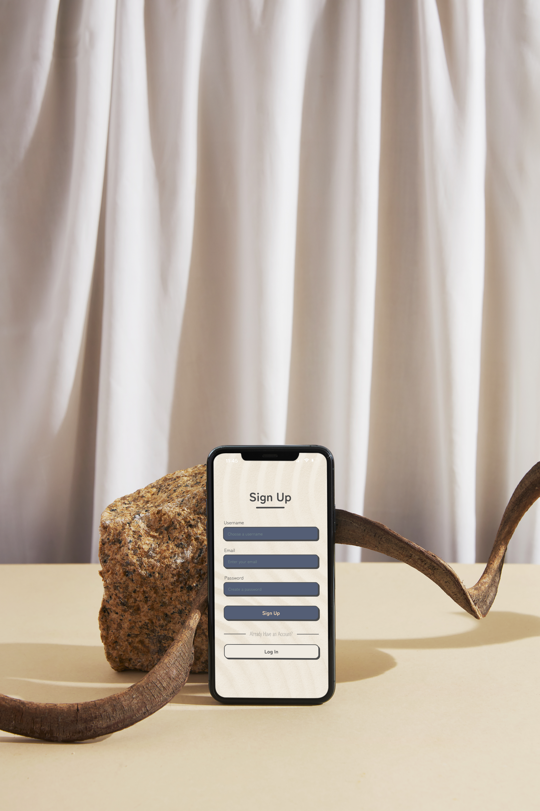

**Onboarding 1**


**Onboarding 2**

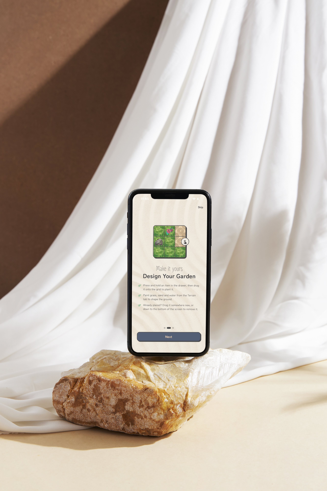

**Onboarding 3**


**Dashboard**

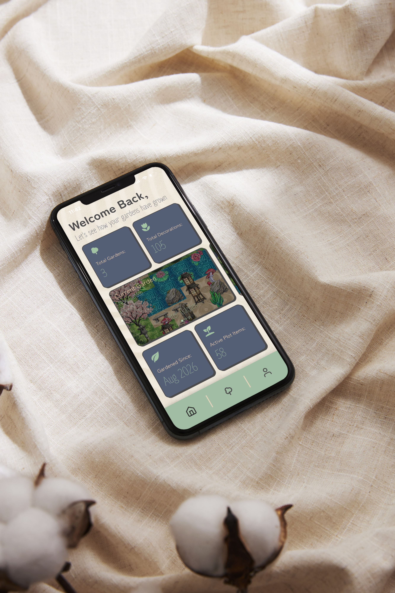

**Garden**


---

## 5. Demonstration Video

<!-- Paste the Google Drive share link between the parentheses below. -->

[🔗 Watch the Demo](https://drive.google.com/file/d/1eaEihzWvE53hKCLBY3YajhB5FA6D2Amp/view?usp=sharing)

---

## 6. Architecture / System Design

- **Frontend**:
  - **Responsibility**: Renders the UI, manages the drag-and-drop garden state, and handles all user interactions.
  - **Framework**: React Native (with TypeScript) on Expo, styled using NativeWind, animated using React Native Reanimated, with gestures driven by React Native Gesture Handler.
  - **Routing**: Expo Router, with a root layout that acts as the auth gate. It holds the native splash screen until fonts, the Firebase session, and the onboarding flag have all resolved, prewarms the garden's artwork so items do not pop in one at a time, then routes the user to the dashboard, splash, or onboarding as appropriate.
  - **Garden model**: The garden is built on a small class hierarchy so that placed things *behave* differently rather than only looking different. A catalog entry is the immutable definition of a placeable thing (its art and footprint), while a placed object is the per-instance state of one sitting in a garden. Only the latter is persisted, and render details are rehydrated from the catalog on load, which keeps saved documents small and lets artwork change without a migration.
  - **Terrain layer**: Terrain is stored separately from objects as a flat cell-to-tile map, so painting a cell is a single-key write and terrain never competes with objects for occupancy.
- **Backend / Services**:
  - **Firebase Auth**: Handles user registration, login, and secure session management, persisted across launches.
  - **Cloud Firestore**: A NoSQL database storing user profiles and saved garden layouts, and handling all CRUD functionality for gardens and placed entities. It uses two collections:
    - `users`, keyed by the account's uid, holding `Username`, `Email`, `AccountCreated`, and `ProfileImageURI`.
    - `gardens`, holding `OwnerId`, `GardenTheme` (the garden's name), `TotalEntities`, `PlacedItems`, `Terrain`, and `CreatedAt`.
  - **Firebase Storage**: Stores profile photos at a fixed path per user, so re-uploading replaces the previous photo rather than orphaning it.
- **Local Storage**: AsyncStorage backs the Firebase session and records whether this device has completed the onboarding tour.

#### System Diagrams

**User Flow**

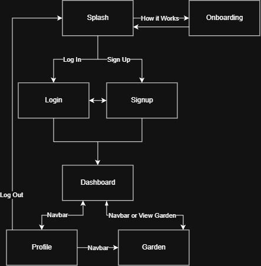

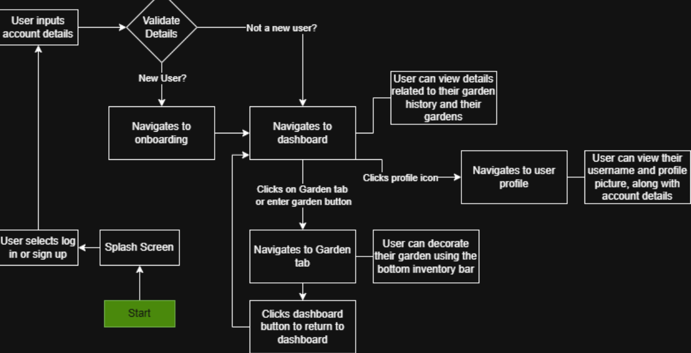

**Collection Schema**

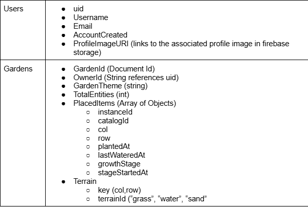

The following are generated with Claude Code. They have been verified and edited by me

**Entity Relationship Diagram**

Two Firestore collections joined by `OwnerId`, plus one Storage path per user. `PlacedItems` and `Terrain` are fields *inside* a garden document rather than subcollections, so loading a garden is a single read.

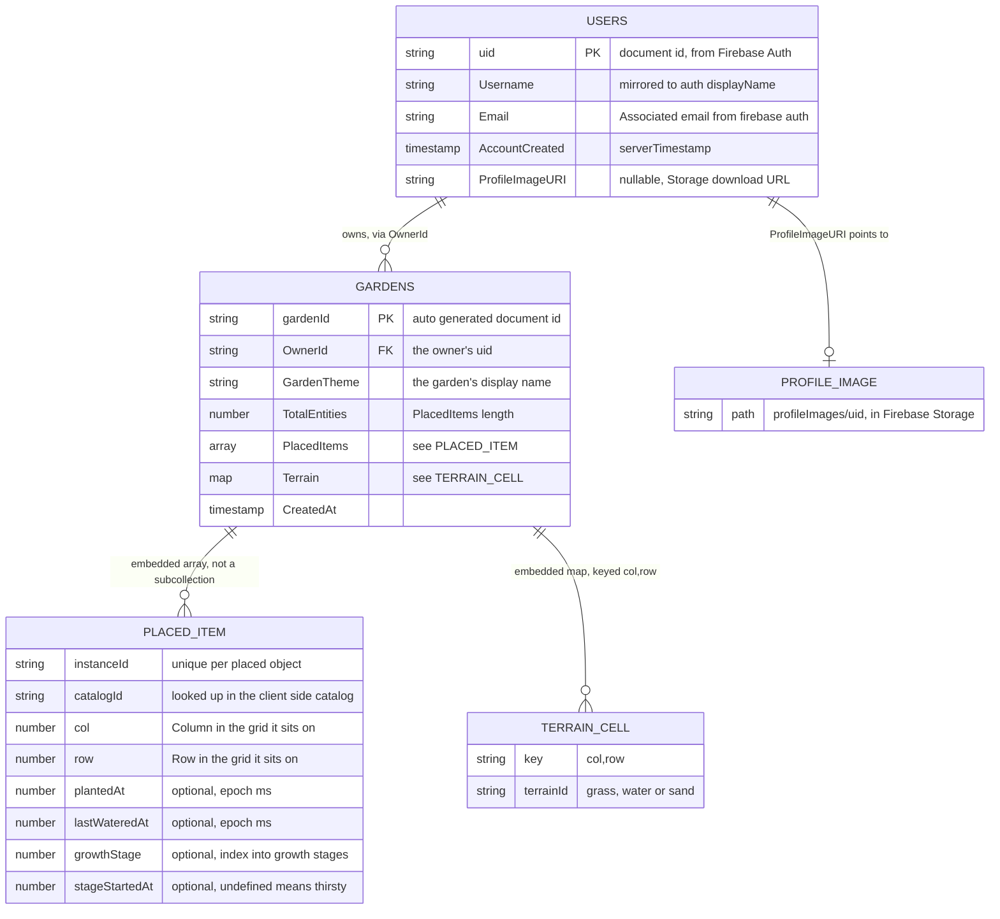

A placed item stores only *what* it is and *where* it sits. Its artwork and footprint live in the app's own catalog and are rehydrated on load, so those details never reach Firestore and the art can change without migrating any saved garden.

**User Flow Diagram**

On launch the app waits on three signals before it decides anything, the fonts, the Firebase session, and the device's onboarding flag. The native splash screen stays up until all three resolve, so the first frame the user sees is never the wrong screen.

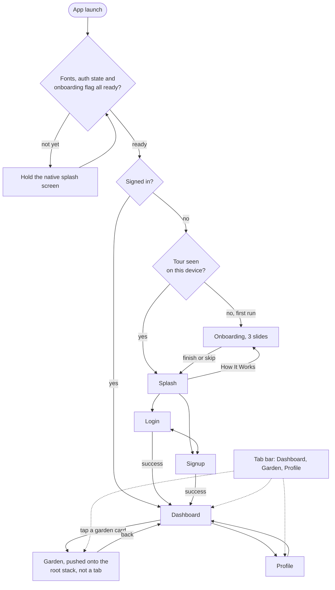

The tour is remembered per device rather than per account, since it teaches gestures rather than anything about a user's data. If that flag cannot be read it defaults to "already seen", so a storage fault can never trap someone in the tour.

---

## 7. Highlights and Challenges

### Highlights

- Designing an entire app around a single, strict constraint (one hand only) and having it shape every UI decision.
- Building a smooth, satisfying drag-and-drop grid system.
- Removing all conventional "engagement" mechanics (streaks, scores, fail states) in favour of a genuinely stress-free experience, growth included, since an unwatered plant waits rather than dying.
- Measuring each growth stage as a duration from the moment it was watered, rather than a deadline from planting, so a garden keeps growing while the app is closed and needs no background process to do it.
- Sharing one seed image and one sapling image across every plant, so a new plant added to the catalog grows correctly straight away with no extra artwork.
- Working with Firebase for authentication, persistent structured garden data, and profile photo storage.

### Challenges

- Keeping the garden grid visually consistent across different device sizes while using a fixed row/column count.
- Handling drag-and-drop placement smoothly alongside asynchronous saves to Firestore, including planning for unstable network conditions.
- Getting touch coordinates right inside a zoomable canvas, where a view's reported position is scaled by the zoom but its reported size is not, which quietly broke placement whenever the garden was zoomed in.
- Keeping catalog identifiers stable, since they are saved against every placed item. Renumbering or reusing one would silently mis-map items in gardens people had already built, so retired items keep their identifier permanently.
- Adding growth to a schema that already had saved gardens in it, without existing grown plants regressing back to seedlings.

---

## 8. Roadmap, Future Improvements

- A rake tool to add patterns into sand patches
- Mimicking real-life events such as rain, via an external API
- Social features to visit other users' gardens
- Unlockable seasonal element sets (e.g. autumn-themed plants)
- Visual themes (e.g. Night mode)

---

## 9. Contributing and License

Any contributions to this project are **greatly appreciated!** To contribute:

1. Fork the repository
2. Create a feature branch: `git checkout -b feature-name`
3. Commit your changes: `git commit -am 'Add feature'`
4. Push to the branch: `git push origin feature-name`
5. Open a pull request

### License

Distributed under the MIT License.

---

## 10. Authors

- Kai Barker, Developer and Designer, [Kai-Barker](https://github.com/Kai-Barker)

Feel free to reach out for questions, feedback, or collaboration opportunities.

## Contact Info

- Kai Barker – [241065@virtualwindow.co.za](mailto:241065@virtualwindow.co.za)
- Kai Barker – [kaieddiebarker@gmail.com](mailto:kaieddiebarker@gmail.com)

---

## 11. Acknowledgements

- [Tsungai Katsuro](https://github.com/TsungaiKats)
- Firebase
- Gemini
- Claude
- [Saironwen](https://www.artstation.com/saironwen) for the [flower assets](https://saironwen.itch.io/flowers-png)
